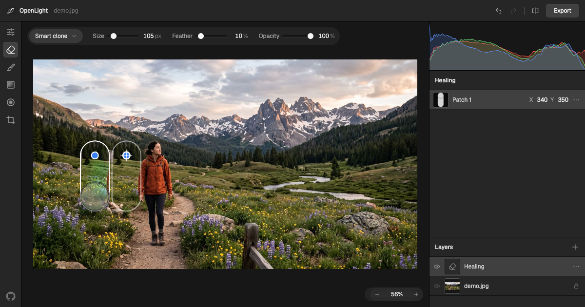

# OpenLight

**An open-source photo editor for the browser, built with [vgpu.sh](https://vgpu.sh).** 
Try it at [openlight.app](https://openlight.app).

Image processing runs on your own GPU with WebGPU. Photos never leave your device.



## Features

**Adjust**

- Exposure, contrast, highlights, shadows, whites, blacks, temperature, tint, vibrance, and saturation.
- Tone curves with a live input histogram.
- Clarity and sharpening.
- Color Mixer with eight hue, saturation, and luminance ranges.
- Vignette.

**Layers and masks**

- Draggable effect layers: Details, Exposure, Color Mixer, Vignette, and Color, which paints one color with Photoshop blend modes.
- Linear and radial masks with their own adjustments and child effects.
- Add and Subtract submasks to shape a mask's coverage.

**Tools**

- Brush, linear, and radial gradient tools on the rail draw masks; their options sit in the bar over the image.
- Brush masks with size, feather, flow, pen pressure, and Alt to erase.
- The mask overlay shows until a mask changes the image, then the image shows the mask; the Overlay button shows or hides it.
- Edits preview at a reduced resolution while you drag, then render in full.

**Compose**

- Crop with aspect presets, rotate, straighten, and flip.
- Pan and zoom the canvas.

**Review**

- Undo and redo, before/after comparison, RGB histogram, and clipping overlays.

**Files**

- Open JPEG, PNG, WebP, AVIF, GIF, BMP, SVG, HEIC, TIFF at 8-bit, 16-bit, and floating-point precision, and camera RAW/DNG with absolute white balance and As Shot reset.
- Import Camera Raw XMP settings.
- Export PNG, JPEG, or WebP with resizing, a live preview, and the resulting file size.

Documents live in memory for now; export saves a flattened image. HEIC needs a browser with a WebCodecs HEVC decoder. RAW decoding uses [raw-webgpu](https://github.com/roprgm/raw-webgpu), which documents format support and limitations.

## Browser support

OpenLight requires WebGPU: a recent Chrome, Edge, Safari, or Firefox.

## Development

```sh
bun install
bun dev
```

See [CONTRIBUTING.md](CONTRIBUTING.md) for browser setup, validation, benchmarks, and the pull request checklist. `window.openlight` exposes a scripting [API](API.md).

## License

[MIT](LICENSE)
