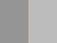
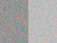
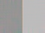
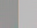
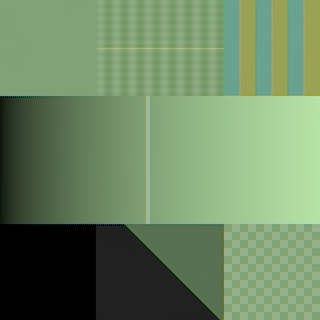

# Noise reduction quality comparison

Actual OpenLight exports comparing PR #19 at
[`d6a5ca5`](https://github.com/roprgm/openlight/commit/d6a5ca55f2ceba9a7c808235313e02a7bf6164d5)
and PR #20 at
[`f4a3c59`](https://github.com/roprgm/openlight/commit/f4a3c59fbf1f639a410f22a83c08f9fd983446ca),
captured on 2026-09-17. Later evidence-only commits do not change either renderer.
These are synthetic Bayer fixtures, not photographs.

## Conditions

Both applications loaded identical fixture bytes from
[PR #20's fixture directory](https://github.com/roprgm/openlight/tree/f4a3c59fbf1f639a410f22a83c08f9fd983446ca/tests/fixtures).
The 320×320 fixtures are only present in that implementation's test tree.

| Fixture pair | Size | Content |
| --- | --- | --- |
| `denoise-clean.dng`, `denoise-noisy.dng` | 64×48 | Flat color patches |
| `denoise-clean.detail.dng`, `denoise-noisy.detail.dng` | 320×320 | Fine texture, gradients, color boundaries and dark regions |

All adjustments were at their defaults, white balance was as shot, and framing
was unchanged. Reference and noisy exports used noise reduction 0. Filtered
exports used noise reduction 100. These settings differ from the exposure +0.25
and contrast +10 used in the separate rendering benchmark.

Environment: Linux, AMD Ryzen 5 3600, Chromium 151.0.7922.34, SwiftShader/software
Vulkan. Both implementations ran sequentially in the same browser, using the
Linux launch flags in `playwright.config.ts`. There were no browser page errors.
No rendering timings were collected in this quality comparison.

## Results

MSE is the mean squared difference from the corresponding clean reference over
RGB channels of the exported 8-bit PNG, in squared channel levels; lower is
better. Alpha is excluded. Maximum channel bias is the largest absolute mean
signed difference among the three RGB channels.

| Comparison | Noisy input MSE | PR #19 MSE | PR #20 MSE |
| --- | ---: | ---: | ---: |
| Flat patches | 60.205187 | 4.908529 | 3.112196 |
| Detail | 7.081618 | 0.368148 | 0.446787 |
| Clean detail input, NR 100 versus NR 0 | — | 0.044779 | 0.000000 |

The detail tile-boundary region `(x=250, y=16, width=16, height=288)` has MSE
0.277127 for #19 and 0.322483 for #20. Full-precision results, including bias,
are in [results.json](results.json).

PR #20 has less error on flat patches and preserves this clean fixture. PR #19
has less error on the noisy detail fixture, including the sampled tile boundary.
This is mixed evidence, not a universal ranking. Zero MSE here means identical
exported 8-bit pixels; it does not establish identical internal floating-point
results. Floating-point accumulation can also vary slightly between runs.
Real high-ISO RAWs, shadows and fine photographic texture remain unvalidated.

## Visual evidence

These are original application exports. Open an image for its native resolution.
The common reference and noisy exports are byte-identical between the two PRs,
so only one copy of each is retained.

| Flat reference | Noisy input | PR #19, NR 100 | PR #20, NR 100 |
| --- | --- | --- | --- |
|  |  |  |  |

| Detail reference | Noisy input |
| --- | --- |
|  |  |

| PR #19, NR 100 | PR #20, NR 100 |
| --- | --- |
|  |  |

For clean-input preservation, compare [the reference](detail-reference.png) with
[PR #19 at NR 100](clean-pr19.png). PR #20's clean-input export is byte-identical
to `detail-reference.png`, so that file also represents its NR 100 result.

## Reproduction

1. Check out the two recorded commits separately, install dependencies and start
   their Vite servers on different ports. Use the same browser/backend for both.
2. Use the fixture bytes from the linked PR #20 commit for both applications.
   For each fixture pair, call `await window.openlight.loadImage(file)` with the
   clean file, then `await window.openlight.exportImage()` to save the reference.
3. Load the noisy file and export at the default NR 0. Call
   `window.openlight.setNoiseReduction(100)`, then await `exportImage()` again.
   Export waits for the filtered result; do not use a fixed sleep.
4. For the detail pair, also load the clean file, set NR 100 and export. Compare
   that output to the clean NR 0 reference to measure clean-input alteration.
5. Decode exports through `createImageBitmap`, draw to a 2D `OffscreenCanvas`,
   and read `getImageData`. For each RGB channel, subtract the clean reference,
   square the difference, sum, and divide by `width * height * 3`. For the tile
   measurement restrict both sums and pixel count to the stated region. For bias,
   average signed differences per channel and take the largest absolute value.

The saved PNGs and raw results also allow independent verification without
rerunning the GPU pipeline. This report adds evidence only; it changes no
application code or rendering workload.
