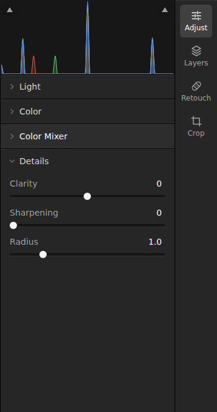
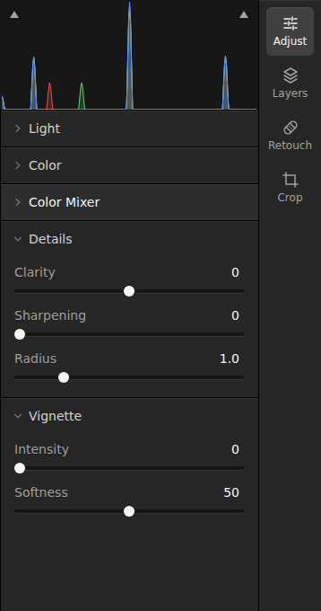
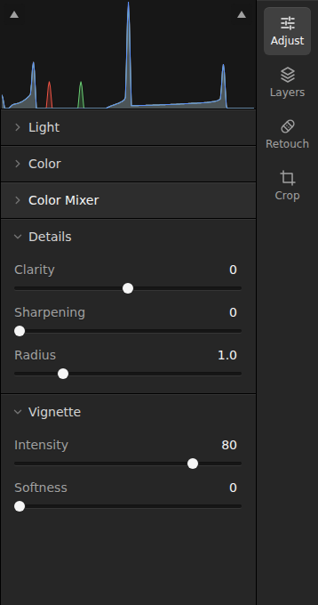
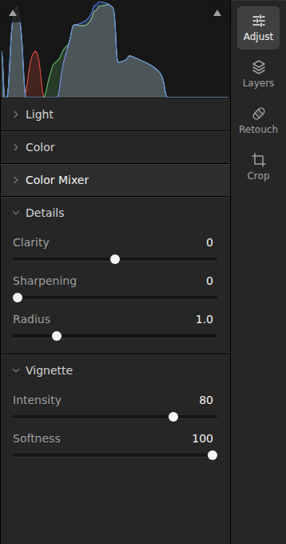
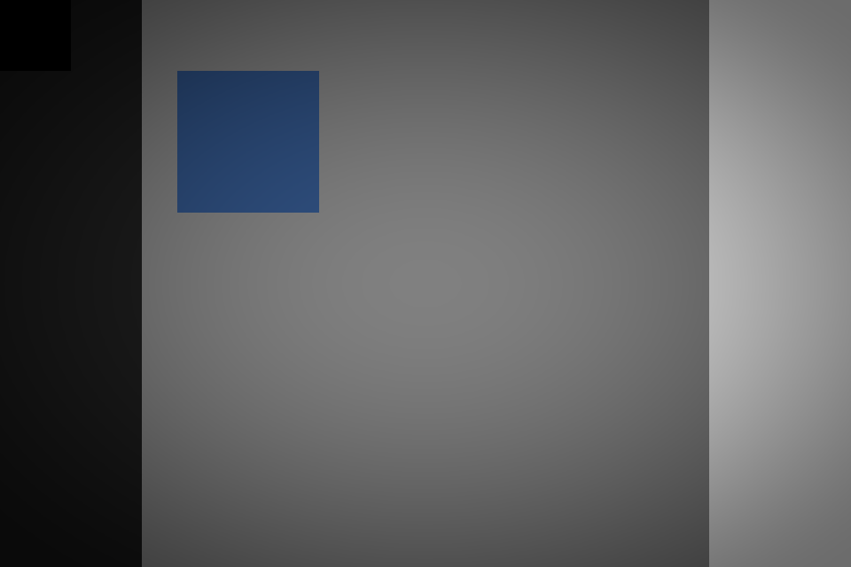

# Vignette evidence

Base: `b7a7389` (main). Head: the implementation in this PR, measured before committing; the raw records retain the base HEAD and `workingTreeChanged: true`. [Source fingerprints](sources.json) identify the measured production files.

## Reproduce

Use the browser setup in the root README. On this Linux host, Chromium's extra libraries were supplied with `LD_LIBRARY_PATH=/tmp/openlight-browser-libs/root/usr/lib/x86_64-linux-gnu`. Commands otherwise use the committed Playwright flags unchanged. Run GPU workloads sequentially.

```sh
# On base: the neutral mixer is the complete editor composition before this change.
bun run test:browser --config playwright.bench.config.ts --grep 'rendering neutral'
# On head:
bun run test:browser --config playwright.bench.config.ts --grep 'rendering vignette-'
bun run test:browser tests/vignette.e2e.ts --workers=1
bun run test:browser tests/editing.e2e.ts --workers=1
```

For UI/output captures, start Vite on each revision, then run the head's capture script from the repository root:

```sh
node docs/benchmarks/vignette/capture.mjs http://127.0.0.1:4174 before
node docs/benchmarks/vignette/capture.mjs http://127.0.0.1:4173 after
```

The screenshots show the real Adjust panel, histogram and mode rail at a 1440×1000 viewport, with Light, Color and Color Mixer collapsed. Source: `tests/fixtures/photo.svg`, 1200×800, all other adjustments neutral, fit view. Exports are 960×640 PNGs. Only vignette intensity/softness vary:

| Main | Disabled (0 / 50) | Narrow transition (80 / 0) | Soft transition (80 / 100) |
| --- | --- | --- | --- |
|  |  |  |  |
|  |  |  |  |

Main and disabled PNG files are byte-identical: SHA-256 `133fa93e6cfb0ffeed5c1c3da232e933a6422e053005c8f58cebdf6a5261c725`.

## Pixel correctness

The GPU test uses uniform linear Rec.2020 `[4, 2, 0.5, 0.25]` in `rgba16float`, at 33×17, 17×33, 1×17 and 1×1. It tests all nine combinations of intensity and softness at 0, 50 and 100 against a double-precision reference of the specified falloff. These synthetic measurements establish the formula's behavior, not perceptual quality on photographs.

| Property | Observed | Limit |
| --- | ---: | ---: |
| Maximum absolute RGB error | 0.000976384 linear channel units | < 0.004 |
| Horizontal/vertical symmetry error | 0 | 0 |
| Alpha error | 0 | 0 |
| Monotonicity violations (radius, intensity, softness) | 0 | 0 |
| Center RGB/alpha | `[4, 2, 0.5, 0.25]` | Exact |
| Intensity 0 pixels | Identical to input for every softness | Exact |

The editing step uses DOM sliders, numeric fields, keyboard input, undo/redo and double-click reset. It verifies histogram updates and compares a PNG export with the actual preview canvas at fit, 1.25× zoom and a 35×20 CSS-pixel pan (tolerance: 2 levels per 8-bit channel). It also checks original/edited comparison and that navigation leaves scene/history unchanged.

The step was run independently because the existing editing session stops at an earlier window-screenshot assertion on this host. To reproduce that isolated run, temporarily create `tests/vignette-session.e2e.ts`, run it with Playwright, then remove it:

```ts
import { test } from "./fixtures";
import { vignetteEditing } from "./vignette-editing";

test("isolated vignette editing session", async ({ page }) => {
  await page.goto("/");
  await page.locator('input[type="file"]').setInputFiles("tests/fixtures/photo.svg");
  await vignetteEditing(page);
});
```

## Rendering performance

Linux, AMD Ryzen 5 3600 (12 logical CPUs), Chromium 151.0.7922.34, **SwiftShader software adapter**. Fixture: deterministic 2400×1600 linear Rec.2020 gradient with HDR values, `rgba16float`; exposure 0.25, contrast 10, neutral mixer/detail/curves, full source frame. Vignette neutral: intensity 0, softness 60. Active: intensity 80, softness 60.

Each workload has 8 warmups and 40 completed samples. Completed rendering includes CPU preparation, command submission and the queue completion wait; excludes loading, display, readback and image encoding. GPU duration uses device timestamps on the isolated vignette pass. Setup and first render are separate one-shot measurements, not steady-state statistics.

| Workload | Setup ms | First render ms | Completed median / p95 ms | Isolated GPU median / p95 ms |
| --- | ---: | ---: | ---: | ---: |
| Main | 48.60 | 341.10 | 258.35 / 267.90 | Bypassed |
| Head, disabled | 46.00 | 340.80 | 252.30 / 260.60 | Bypassed |
| Head, active | 44.10 | 434.50 | 335.05 / 348.00 | 74.55 / 76.47 |

The disabled path adds no GPU pass or output texture. Its small timing decrease is run-to-run variation, not a claimed optimization. Active processing adds one full-resolution render pass and one lazily allocated 2400×1600 `rgba16float` texture (30,720,000 bytes), reused until renderer disposal. In this workload the pass count increases from one to two. The measured active cost is intentional; these software-backend timings do not establish a hardware frame budget. No missing samples; physical GPU performance remains unmeasured.

Raw samples and environment: [base](base.json), [head disabled](neutral.json), [head active](active.json). Benchmark rendered outputs: [disabled](benchmark-neutral.png), [active](benchmark-active.png).

## Verification gaps

Chromium window screenshots omit the WebGPU canvas on this host, including on main, while native canvas readback contains the rendered image. The new editing step reads that actual canvas via `toDataURL()` before browser window compositing. Panel screenshots and exported output are shown separately above; full-window visual presentation remains unverified in this environment.

Final required checks: `bun run check`, `bun run build`, and all 11 Bun tests pass. The full browser suite has 6 passes and 3 failures: editing viewport screenshot, RAW preview screenshot, and HEIC loading. All three were reproduced on unchanged main with the same Chromium flags: [head log](head-browser.txt), [main reproduction](base-browser.txt). The isolated vignette UI step passes. The two vignette benchmarks pass, including all 40 GPU timestamp samples for the active pass.
