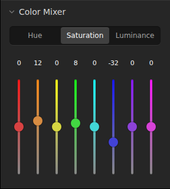

# Color Mixer

Eight color ranges share a Hue / Saturation / Luminance selector and vertical sliders. Values run from -100 to 100. Numeric fields support typing and scrubbing; double-clicking a slider resets that value. The Adjust panel groups a drag or repeated key presses into one undo step.

The feature owns its controls, range metadata, edit commands, GPU pass and shader. The serializable `ColorMixer` shape lives with `Scene`; the document compares its channel arrays for history. `app/editor/renderer.ts` injects the pass into the renderer for both preview and export, after tone curves and before detail filters. Lower-level modules do not import this feature.

## Color processing

The pass transforms linear Rec.2020 into Oklab using [Bjorn Ottosson's public-domain matrices](https://bottosson.github.io/posts/oklab/). Range centers are the Oklab angles of fully saturated sRGB red, orange, yellow, green, aqua, blue, purple and magenta. Neighboring ranges interpolate with a smoothstep, including the circular magenta/red boundary. Selection fades near neutral to avoid amplifying gray noise.

- Hue rotates Oklab chroma by up to 30 degrees in either direction.
- Saturation scales chroma from zero to twice its original magnitude.
- Luminance scales linear luminance by up to one stop in either direction.

Hue and saturation preserve the pixel's linear luminance. Alpha and HDR headroom are retained; the existing display pass maps out-of-gamut colors. Neutral settings bypass the pass without allocating an output texture. The WGSL import uses a relative path because the shader loader does not resolve Vite's `@/` alias.

Use `window.openlight.setColorMixer("blue", { saturation: -25 })` or `resetColorMixer()` to perform the same edits as the UI.
